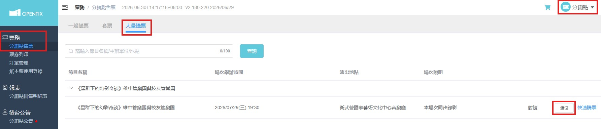
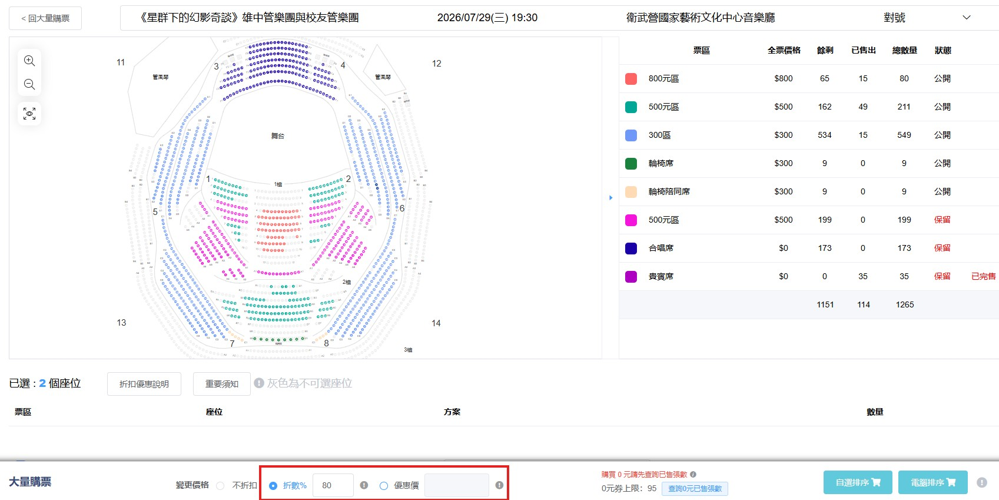

# 團練行政流程指引

- [負責人名單](#負責人名單)
- [音樂會人事與團練點名](#音樂會人事與團練點名)
- [音樂會總務](#音樂會總務)
- [音樂會票務](#音樂會票務)
- [票務與總務協作項目](#票務與總務協作項目)

## 負責人名單

#### 音樂會人事
- 統籌：家齊
- 執行：家齊、侑宸
- 團練點名
  - 🐉 龍團：冠程
  - 🌟 星團：侑宸

#### 音樂會總務
- 統籌：子謙

#### 音樂會票務
- 統籌：品融

 

## 📍音樂會人事與團練點名

### 工作項目

1. 統籌與收集**人事基本資料**
    1. 確認未成年團員之保險家長同意書繳交
    1. 處理保險投保
1. 傳達並確認以下資訊給**兩團分部長**
    1. 電子樂譜發放
    1. 確認演出人員名單（包含姓名校對）
    1. 確認團員皆有正確填寫[人員資料與團練調查表](https://forms.gle/XFu6gSpB52mKFhHr5)
    1. 確認團員都有進到 [LINE 大群](https://line.me/R/ti/g/rT01N2E5Tq)，可得到最新消息
1. 團練**出席點名**
    1. 分部長確認出席後，回報人事登記
    1. 統一收發姓名牌

### 相關表單與檔案

- 演出及工作人員資料與團練調查：[https://forms.gle/XFu6gSpB52mKFhHr5](https://forms.gle/XFu6gSpB52mKFhHr5)
- [《星群》人員資料與團練調查：回覆結果](https://docs.google.com/spreadsheets/d/1Uv-LNNq__V5M1YWl10En8RiOG1vhJyWzkaHw94YCH48/edit?resourcekey=&gid=1104497967#gid=1104497967)
- [投保家長同意書](https://drive.google.com/file/d/16PfSGRhGYH9BWG1IcDWJirXhHHNlHktl/view?usp=sharing)

### 分部長名單

||龍團|星團|
|---|---|---|
|長笛|劉子謙|劉子謙|
|雙簧管／巴松管|吳宥陞|吳宥陞|
|豎笛|黃冠程|黃冠程|
|薩克|邵康揚|邵康揚|
|法國號|梁莊堯|梁莊堯|
|小號|呂紹銨|呂紹銨|
|長號|林岱威|許侑宸|
|低銅／貝斯|莊才昇|黃浚賀|
|打擊／鋼琴|林畇昕|劉昱翔|

 

## 📍音樂會總務

### 工作項目

1. 收團費與活動費：需開收據與繳費證明
2. 團員半價方案繳費

### 團員費用

- 團費 500 元：領團員票 2 張
- 活動費 1000 元（演出人員必須要繳交）

 

## 📍音樂會票務

### 工作項目

1. 票券管理（刷票、取票）：寄信到 OPENTIX 窗口後，到衛武營領票，並協助保管與發放。
    1. 團員票：繳納團費可以領取團員票 2 張。
    1. 貴賓票
    1. 團員半價方案領票
1. 寄票處理：暫訂 7/25 後，開放寄票。

### 自行購票優惠

OPENTIX 網址：[https://www.opentix.life/event/2053691239618875392](https://www.opentix.life/event/2053691239618875392)

- 輸入團員折扣碼 ksawokswb 享 8 折優惠

### 貴賓票發放

1.  貴賓票登記
    1. 貴賓：公關跟票務溝通，確認要寄票還是直接拿，並記錄座位和貴賓。
    1. 校內老師：給 800 元區或 500 元區，也記錄座位。
1.  校內老師貴賓票發放規則
    1. 除了主任等貴賓會由我們邀請之外，其餘老師需要貴賓票，可以提供 1 張 800 元區，或 2 張 500 元區。其餘請學生婉轉地提供優惠碼給老師。

### 刷票流程

1. 確認需要的票區、位置及刷出金額顯示
    1. 票區：原價為貴賓席、800 元區、500 元區、300 元區
    1. 位置：○樓○排○號，因奇數偶數不同側，建議全部直接一一列出
    1. 刷出金額顯示：顯示在紙本上面是寫貴賓券、或是以折價票開出（e.g.以 7 折印出）
        1. 貴賓票：貴賓券印出
        1. 團員票：貴賓券印出
        1. 團員半價方案：貴賓券印出
        1. 其他：無特殊名義，則以 8 折印出（同團員折扣碼優惠）
1. 當刷票數量較多，可以用以下連結的票圖，用底色標出座位區，寄信時截圖或附檔。
    - [衛武營座位圖 Google Sheet](https://docs.google.com/spreadsheets/d/1uEL-VD41EXEe0VyHIiUm4fozTyxbm948/edit?usp=sharing&ouid=114432644412048019090&rtpof=true&sd=true)
1. 寄信給窗口，如以下附註。
    - OPENTIX 窗口：黃敏娟　小姐
        - 信箱：vicki_huang@mail.npac-ntch.org
        - 電話：06-3362632
1. 收到回信後即可前往衛武營取票
    - OPENTIX 高雄服務處
        - 地址：830043 高雄市鳳山區三多一路1號 （衛武營國家藝術文化中心三樓服務中心對面）
        - 聯絡電話：07-710-5958
        - 售取票服務時間：週一至週五 11:00-12:30、13:30-18:00

範例如下：

> 黃小姐您好：                 
>                  
> 以下節目有取票之需求，隨信附上相關票券資訊，再麻煩您協助撥冗處理。                 
> 若有任何資訊缺漏或需要確認的地方，再請不吝回信告知，謝謝您的幫忙！                 
>                  
> 節目名稱：《星群下的幻影奇談》雄中管樂團與校友管樂團                 
> 演出時間：115 年 7 月 29 日 19:30                 
> 演出地點：衛武營國家藝術文化中心音樂廳                 
>                  
> 取件地點：高雄服務處（衛武營）                                  
> 取件人：○○○　先生                 
>                  
> 【800元區】（以貴賓券印出）                 
> 1 樓 9 排：6、8、10、12                 
> 1 樓 10 排：4、6、8、10                 
> 【500元區】（以 7 折印出）                 
> 2 樓 B2 排：5、7、9、11、13、15、17、19                 
>                  
> 共 16 張                 

### 後台自行調票與取票流程

因團員半價方案需要即時確認位置，以上述方法會需要頻繁寄信，且晚上或假日 OPENTIX 窗口無法協助，因此申請開啟後台調票權限。

#### OPENTIX 後台調票

**票券訂購**

1. 登入進入[後台：分銷點首頁](https://opt.console.opentix.life/retail/index.html#/user/main/)
    - 主辦單位頁為綠底、分銷點為藍底。可以透過右上方選單切換。
1. 左方選單【票務】＞【分銷點售票】，並選擇【大量購票】後，點擊【選位】。
    - 務必要選擇【大量購票】頁，才是不用付款的。一般訂票是要向 OPENTIX 付費。
1. 選位後，下方選擇變更價格。操作完成後，點選電腦排序後，會加到購物車中。
    1. 貴賓票：`優惠價` 填寫【0】
    1. 八折票：`折數%` 填寫【80】
1. 全部票券選位完成後，點選右上購物車，進入購物車頁。
    1. 取票方式：【紙本票】
    1. 付款方式：【調票】
    1. 勾選【我已確認用此付款方式結帳】
    1. 點選【確認結帳】即完成（不需要再點下一步列印票券）

  
  

**票券訂單編號確認**

- 左方選單【票務】＞【票券列印】＞【未印票券】＞【取得所有未印票券】

**當日票券取消**

1. 取得訂單編號
1. 左方選單【票務】＞【訂單管理】＞【廢票】
1. 輸入編號或【區間】後點擊前往＞刪除票券

#### 印票取票流程

- 將訂單資訊、總印票張數、OPENTIX 帳號密碼，寄給 OPENTIX 窗口
- 票券資訊可用以下方式提供
  - 列出訂單號碼
  - ○ 月 ○ 日～○ 月 ○ 日的訂單
  - 「所有未印出的票券」

### 寄票流程

- 寄票表單：[https://forms.gle/QGhoywd9ZWDANNr19](https://forms.gle/QGhoywd9ZWDANNr19)
- [寄票表單後台](https://docs.google.com/spreadsheets/d/137ed67QpIim21Aj605hPjLrnxJN61gt1qjtLRFWUC0c/edit?usp=sharing)
- [寄票表單編輯](https://docs.google.com/forms/d/1vAob_vghozOt6XDJ3i1Opp0aAr2EcrX7WxXbUEWIoe0/edit)

1. 團員須先取得實體票券     
2. 團員填寫寄票表單後，並將票券裝至信封中，交到寄票處
3. 寄票處收集，在演出前依照後三碼順序排列

 

## 📍票務與總務協作項目

### 團費領票
**繳交團費後可領團員票 2 張**

### 團員半價方案
**團員加價 1,000 元，可領取 500×4 或 800×2 或 300×6 的票券**

## 附錄

### 高雄中學校友管樂團　組織章程　節錄
> 第 7 條               
> **團費分為入團費及常年團費。其數額之變更，應由一級主管會議提出，團員大會二分之一以上團員決議，並於次年度生效。**               
> 入團費，應於入團時繳納取得團員資格。               
> 常年團費，應每年繳納，週期自一月一日起至十二月三十一日止。               
> 常年團費得於當年度週期結束前隨時繳納。               
> 團員一次繳納二十年常年團費者，為本團終身團員，無需再繳納常年團費。               
> 未繳納常年團費，暫停團員資格。欲恢復者，應補繳納團費，惟不需跨年度補繳納。               
> 團費優惠、折扣之辦法，以規則另訂之。               
> 高雄中學管樂團團員，於繳納該團團費後，適用本章程有關團員之規定，惟團員大會及選舉、被選舉、罷免之權利不適用之。          

P.S. 在未變更以前，入團費為 200 元，常年團費為每年 500 元。