# 如何抵達團練地點？

- [雄中排練場地](#雄中排練場地)
- [衛武營排練場地](#衛武營排練場地)

## 雄中排練場地

**高雄中學　綜合大樓四樓　英文科小劇場**      
地址：高雄市三民區建國三路50號     

🚨今年綜合大樓一樓電梯也需要磁扣感應，會有校內團員排值班同學協助～（大感謝！）        

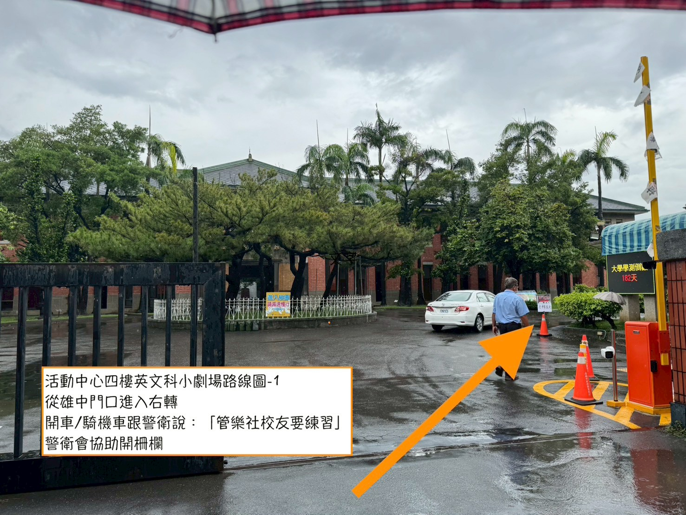     
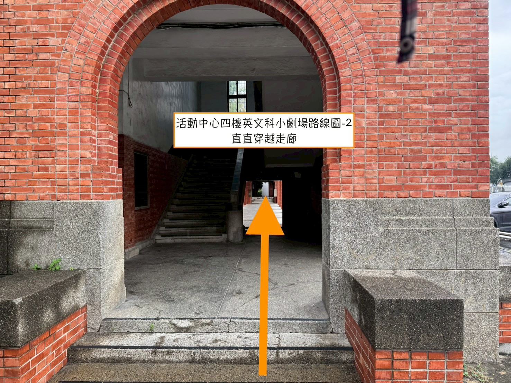     
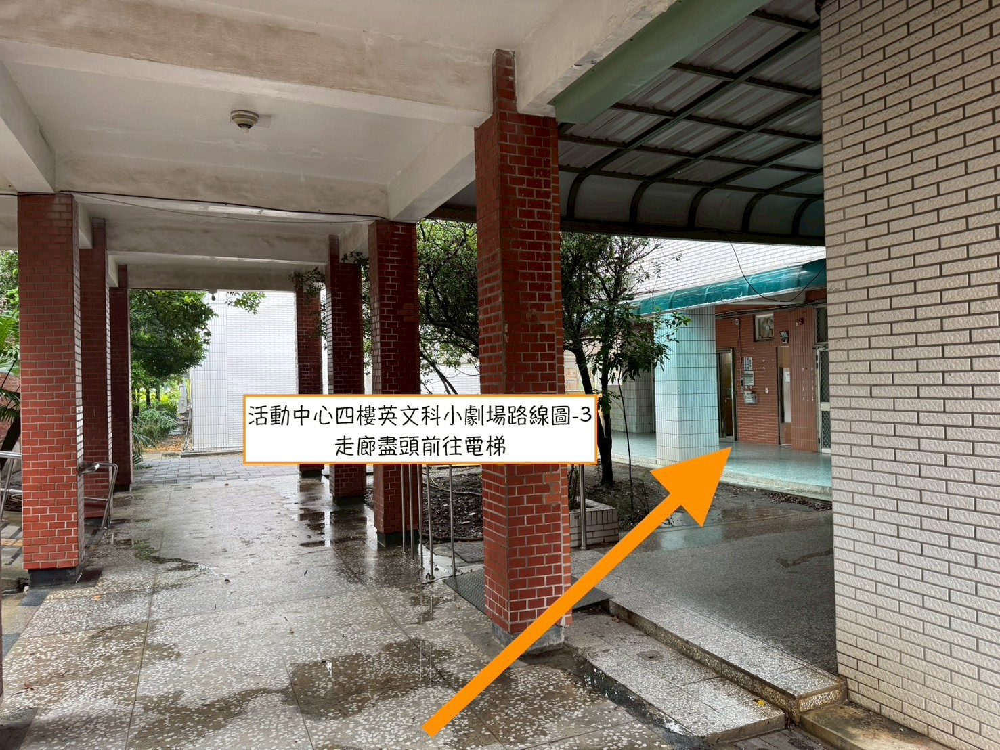     
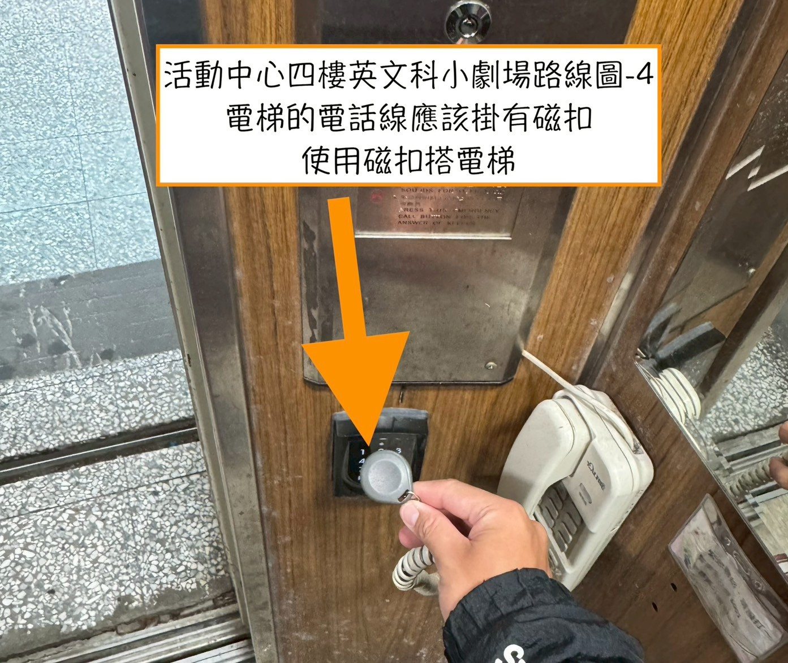     
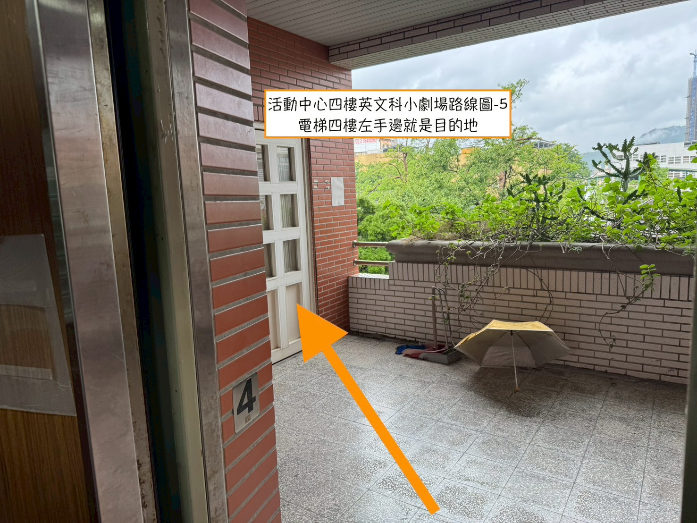     
 
 

#### 其他雄中排練場地

1. 社辦：實驗館地下一樓
2. 教室：活動中心（社辦旁邊那棟）三樓

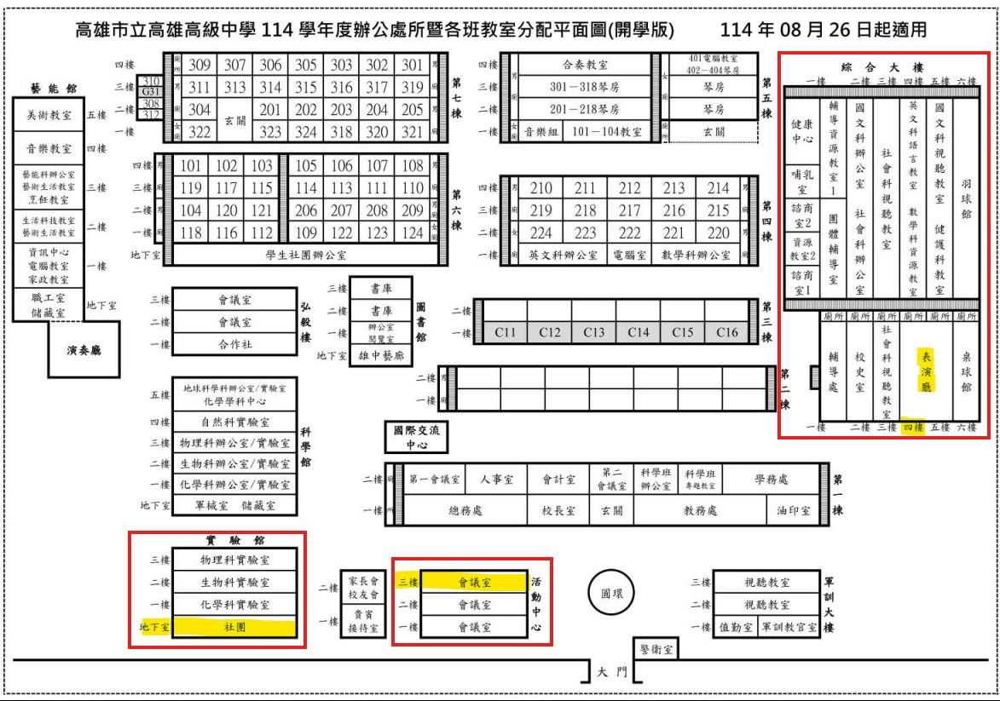     

**活動中心三樓**

- 前後有冷氣各一，上完課要關
- 北側牆（靠學校這邊的牆壁）上面是燈的開關

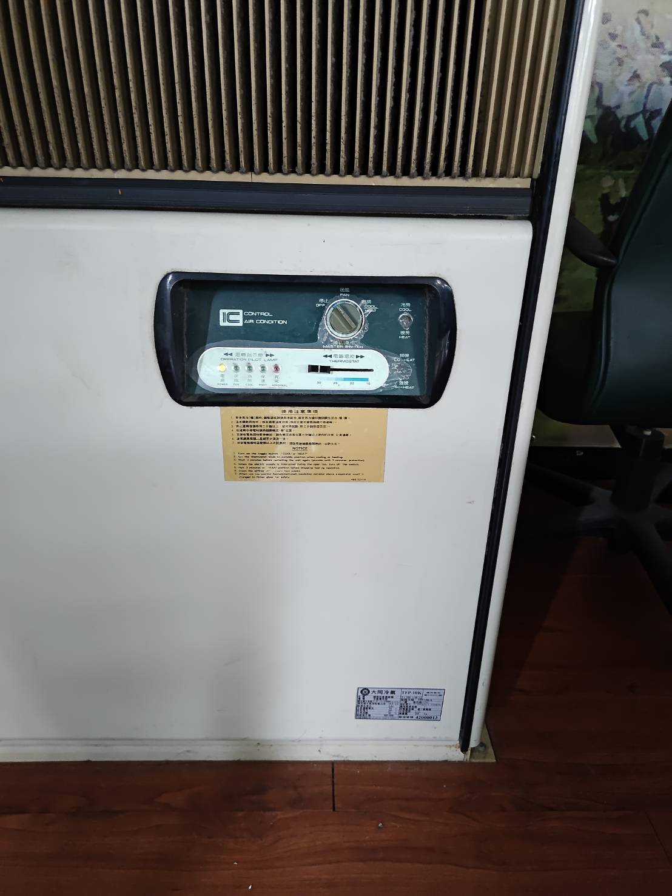     
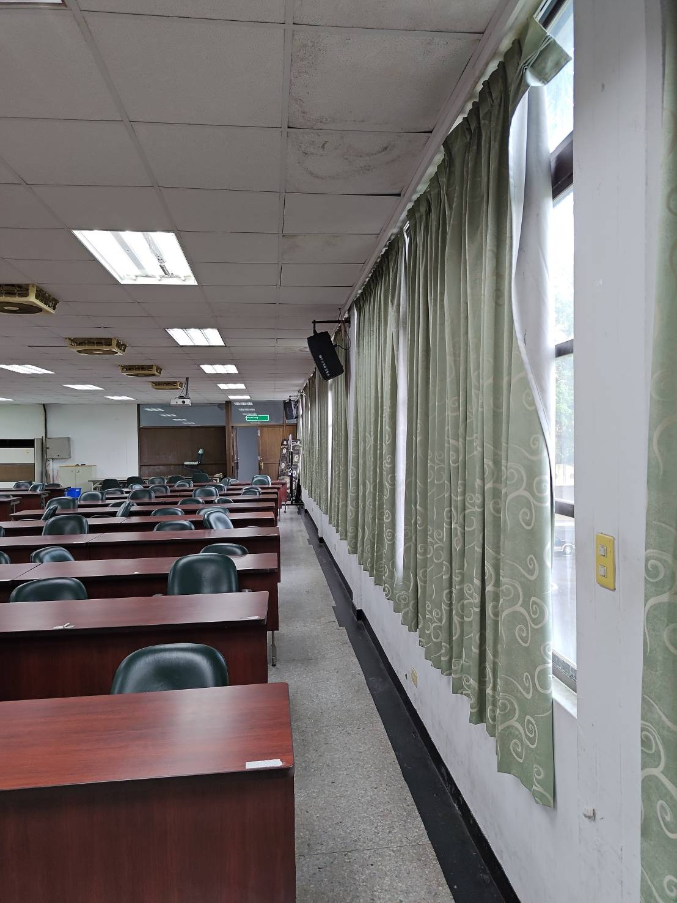     

  

## 衛武營排練場地

7/27：**衛武營 B304 合唱排練室**          
7/28：**衛武營 B313 樂團排練室**          
7/29：**衛武營音樂廳後台**         
地址：高雄市鳳山區三多一路 1 號         

### 衛武營出入口

- **東側演職人員出入口**（靠國泰路）
- B1 停車場演職人員入口
- 營運辦公室（近捷運）

進入場館時需持演出工作證通行，或**刷身分證或健保卡**進入場館。      
沿著指標前往地下三樓 B304 合唱排練室或 B313 樂團排練室。

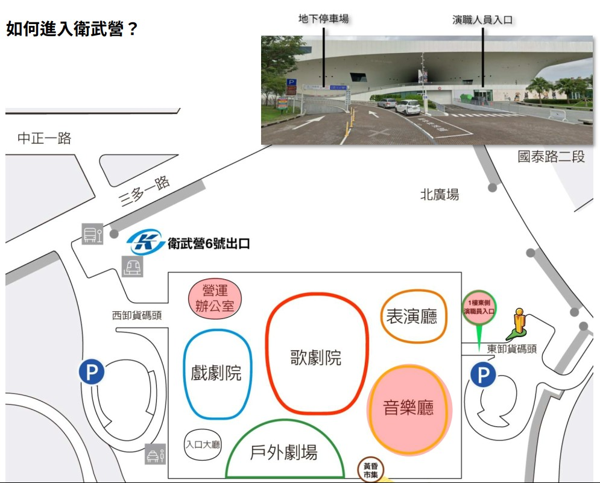   
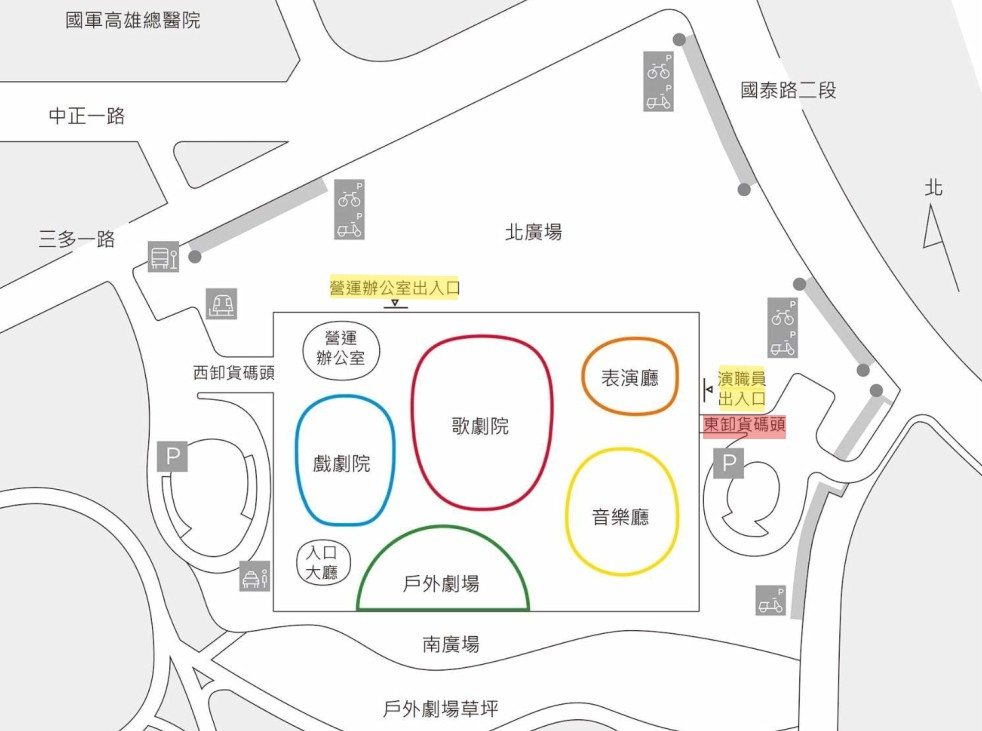   
 
### 音樂廳後台
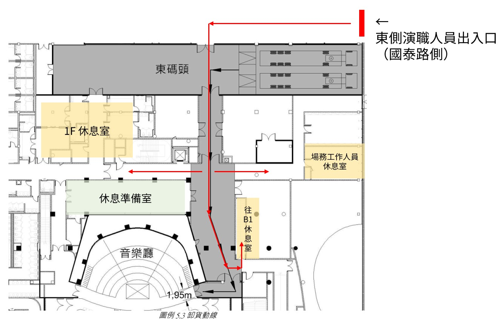   
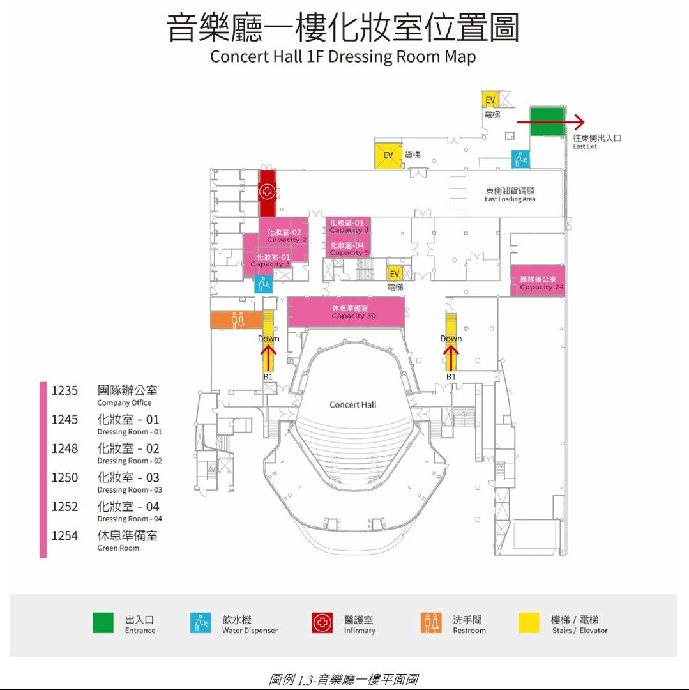   
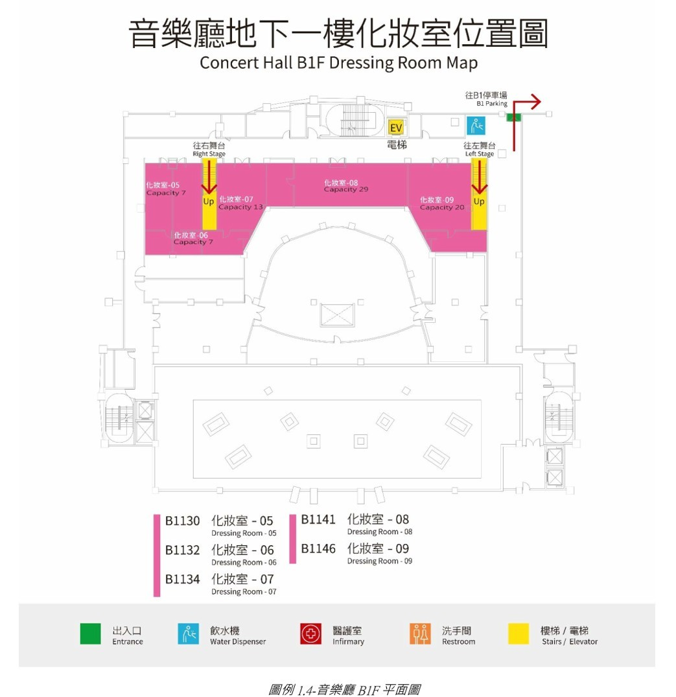   
