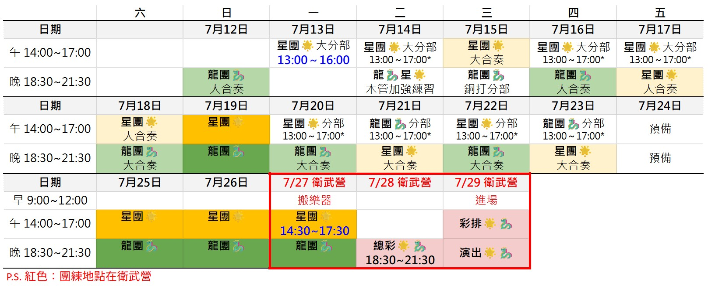

  

#### ⚡ 快速捷徑
- [團練時間表](#團練出席)
    - [ℹ️ 怎麼去排練場地？](location_info.md)
    - ✏️ 填寫[基本資料與出席表單](https://forms.gle/XFu6gSpB52mKFhHr5) 
    - [出席點名表]((https://docs.google.com/spreadsheets/d/1ZqVxk69gxManb5Qf4JO3Z04tJ1CI6iW7U7Wj4kAr6F8)
)
- [團費與團員票規則](#團費與票務) 
    - [ℹ️ 我該繳多少費用？](https://docs.google.com/spreadsheets/d/1qtmEVaePaVPPVScvtmeRbesSBFAVDRuCU7Pi3GTUHr4/edit?gid=319775402#gid=319775402)
    - [團員票圖](https://docs.google.com/spreadsheets/d/1qtmEVaePaVPPVScvtmeRbesSBFAVDRuCU7Pi3GTUHr4/edit?gid=1696288439#gid=1696288439)
    - [線上購票](https://www.opentix.life/event/2053691239618875392)輸入 `ksawokswb` 團員 8 折
    - [團員半價優惠介紹](#團員半價優惠方案)
    - ✏️ 填寫[寄票表單](https://forms.gle/QGhoywd9ZWDANNr19)
- [曲目順序](#曲目順序)
    - [示範音檔清單](https://youtube.com/playlist?list=PLTwGp7yPzLtsztraYg2UaE-7z50kd9v-f&si=QilE1V3tQiAhY9mz)
    - [說書人文本](#說書人文本)

## 📍團練出席

       
**🕒 團練時間**    
- 下午：14:00\~17:00、晚上：18:30\~21:30。
    - 如有不同時間會額外標示。

**🏫 團練地點**      
- 7/26 前：雄中綜合大樓四樓英文科小劇場
  - ℹ️ [如何前往雄中排練場地](location_info.md/#雄中排練場地)
- 7/27 衛武營 B304 合唱排練室
  - ℹ️ [如何前往衛武營排練場地](location_info.md/#衛武營排練場地)
- 7/28 衛武營 B313 樂團排練室
- 7/29 衛武營音樂廳後台
         
### 演出人員分團與分部長名單

- [演出人員與分部長名單](member/index.html)

### 基本資料與出席表單

請假方法：事先填寫出席表單請假。若臨時請假，請通知分部長，並說明原因請假。
- ✏️ 填寫[基本資料與團練出席調查表單](https://forms.gle/XFu6gSpB52mKFhHr5)
- [《星群》人事資料總表](https://docs.google.com/spreadsheets/d/1qtmEVaePaVPPVScvtmeRbesSBFAVDRuCU7Pi3GTUHr4)
- [《星群》出席點名表](https://docs.google.com/spreadsheets/d/1ZqVxk69gxManb5Qf4JO3Z04tJ1CI6iW7U7Wj4kAr6F8)

 

## 📍團費與票務

### 🔸團費與團員票資訊

- 校友費用：團費 500 元、演出活動費 1,000 元，共 1,500 元。
  - 首次入團須額外繳納入團費 200 元
  - [點此可查閱應繳金額與付款紀錄](https://docs.google.com/spreadsheets/d/1qtmEVaePaVPPVScvtmeRbesSBFAVDRuCU7Pi3GTUHr4/edit?gid=319775402#gid=319775402)
- 校內費用：演出活動費 1,000 元。
  - 高三畢業生也算校內團員
- 團員票：繳交團費可領取**團員票 2 張**。

### 🔹團費繳費

#### 【校友】
校友可選擇**現場繳交**或**線上繳交**。

**現場繳費** 
- 團練現場繳交給**音樂會總務劉子謙**。

**線上繳費** 
- 轉帳至校友團帳戶，**「轉帳備註請寫上姓名」**。
- 校友團帳戶（中華郵政）
  - 郵局：台南成功大學郵局
  - 帳號：(700)00310710954365
  - 戶名：高雄中學校友管樂團謝麒諺
- 線上繳費**須等一天**，由校友團財務確認後，才能領取團員票。

#### 【在校生】
聯繫**校內總務黃宥穎**繳費。

### 🔹團員票領取
繳費確認後，團練期間找**音樂會票務曾品融**現場取票。 
現場領取時，可先[查閱團員票圖](https://docs.google.com/spreadsheets/d/1qtmEVaePaVPPVScvtmeRbesSBFAVDRuCU7Pi3GTUHr4/edit?gid=1696288439#gid=1696288439)，選擇領票座位。

### 🔸團員購票優惠資訊

#### 團員折扣碼
- [👉 OPENTIX 節目購票](https://www.opentix.life/event/2053691239618875392)
- 輸入團員折扣碼 **ksawokswb** 享 8 折優惠

#### **團員半價優惠方案**⭐    
**加價 1000 元**，可領原價 500 元票 4 張，即等同**半價優惠**。    
- 每位團員僅限 1 次。
- 限由票務刷票，一次需購買 4 張，**不得分次**。
- 可改成領取 800 元票 2 張，或 300 元票 6 張。 

### 🔹團員半價優惠繳費與領取

1. 填寫[團員半價優惠表單](https://forms.gle/m9iyGwYWh59gjexY9)，選擇票種。
1. 現場繳費 1,000 元，給**音樂會總務劉子謙**。
1. 找**音樂會票務曾品融**訂票。以當下即時 [OPENTIX 可售座位](https://www.opentix.life/event/2053691239618875392)選擇座位。
1. 訂票完成後，因需 OPENTIX 官方印票與取票，約兩個工作天後由票務給票。

 

### 🔸寄票

🚨預計 7/25 開放寄票                
填寫表單後，並將票券裝至信封中，交到寄票處。

- ✏️填寫[寄票表單](https://forms.gle/QGhoywd9ZWDANNr19)
- [寄票表單後台](https://docs.google.com/spreadsheets/d/137ed67QpIim21Aj605hPjLrnxJN61gt1qjtLRFWUC0c/edit?usp=sharing)

寄票處開放時間地點：

- 7/25 - 26 午、晚 ＠ 雄中英文科小劇場
- 7/27 午、晚 ＠ 衛武營 B304 合唱排練室
- 7/28 午、晚 ＠ 衛武營 B313 樂團排練室
- 7/29 11:00-13:00 ＠ 衛武營後台休息準備室

 

## 📍音樂演出

### 曲目搭配參考資訊

#### 📖 說書人文本
- [Alex and the Phantom Band](story/alex)
- [Gulliver’s Travels](story/gulliver)
- [流星群の物語～はかなくも壮大な宇宙へ～](story/star)

#### 🎬 YouTube 示範影片
- [樂曲影片清單](https://youtube.com/playlist?list=PLTwGp7yPzLtsztraYg2UaE-7z50kd9v-f&si=QilE1V3tQiAhY9mz)

### 演出曲目

#### 龍團🐉
- **Fanfare for the Common Man** - Aaron Copland
  - 平凡人的號角／艾倫．柯普蘭
- **Alex and the Phantom Band** 📖- David Maslanka
  - 艾力克斯與幻影樂團／大衛．馬斯蘭卡
- **童玩** - 詹采軒
  - 童玩／詹采軒
- **How to Train Your Dragon** - John Powell (arr. Bertrand Moren)
  - 馴龍高手／約翰．包威爾（編曲：貝特朗．莫倫）
      
#### 星團🌟
- **Gulliver’s Travels** 📖- Bert Appermont
  - 格列佛遊記／伯特．阿佩蒙特
- **掃除用具のファンタジー** - 三浦秀秋
  - 打掃用具幻想曲／三浦秀秋
- **流星群の物語～はかなくも壮大な宇宙へ～** 📖- 三浦真理（arr. 佐川馨）
  - 流星雨物語──致虛幻而壯闊的宇宙／三浦真理（編曲：佐川馨）
- **Sandpaper Ballet** - Leroy Anderson (arr. Hans van der Heide)
  - 砂紙芭蕾／勒羅伊．安德森（編曲：漢斯．范．德．海德）
- **Selections from Disney’s Moana** - arr. Jay Bocook
  - 海洋奇緣選粹／編曲：傑．博庫克

### 曲目順序
#### 上半場
- 🐉 **Fanfare for the Common Man**
  - 🎺 小號、長號在二樓合唱席吹奏
- 🐉 **Alex and the Phantom Band**
  - 📖 說書人：李佳勳
- 🚨 樂團換場 ──────────────
  - 📖 說書人：李佳勳
- 🌟**Gulliver’s Travels** - Bert Appermont
  - 📖 說書人：李佳勳
- 🌟**掃除用具のファンタジー** - 三浦秀秋
  - 🧹 在舞台前方舞蹈

#### 下半場
- 🌟**流星群の物語～はかなくも壮大な宇宙へ～**
  - 📖 說書人：莊福泰　校長
- 🌟**Sandpaper Ballet**
  - 🥁 打擊在舞台前方演奏砂紙
- 🌟**Selections from Disney’s Moana**
- 🚨 樂團換場 ──────────────
  - 🪀 童玩換場
- 🐉 **童玩**
- 🐉 **How to Train Your Dragon**